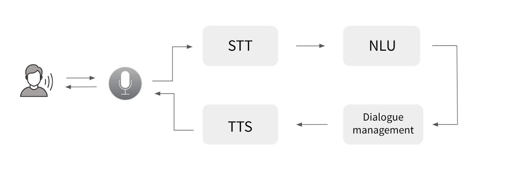

# About

Minibot is a demonstration of how conversational experiences can be created in Catalan using open-source language technologies.

It is built with open-source speech recognition (STT), speech synthesis (TTS), and natural language understanding (NLU) technologies. This repository includes the central NLU language understanding server with RASA, its connectors to the STT microservice based on [Vosk](https://github.com/alphacep/vosk-server), and the Catalan TTS-API based on [🐸 Coqui TTS](https://github.com/projecte-aina/tts-api).

### Architecture Overview

The complete architecture is illustrated below


For more details on the architecture and how to build a voice assistant with RASA and Mozilla tools, refer to [this guide](https://medium.com/rasa-blog/how-to-build-a-voice-assistant-with-open-source-rasa-and-mozilla-tools-c05c4ec698c6).

### Questions and answers
[Document](https://docs.google.com/document/d/1ZOC0wRiWv2Ogmc3kf7xQtD-HhZrFjaF00zKGes5ct90/edit?usp=sharing) with the questions and answers that the minibot can handle.


### Rasa documentation
To iterate Rasa's service behavior, you will need some basic knowledge of Rasa, therefore we attach links of interest to the documentation.
* [Introduction to Rasa Open Source](https://rasa.com/docs/rasa/)
* [Language Support](https://rasa.com/docs/rasa/language-support/)
* [Command Line Interface](https://rasa.com/docs/rasa/command-line-interface)


## Setup development environment

Create and activate a Python virtual environment.
```
python3 -m venv venv
source myvenv/bin/activate
```

Install required dependencies
```
pip install -r requirements.txt
```

To train the model use
```
rasa train
```

To test the model using the shell use
```
rasa shell
```

## Deployment

### Prerequisites

Make

[Docker](https://docs.docker.com/engine/install/ubuntu/)

[Docker compose](https://docs.docker.com/compose/install/)

### Environment Variables

To deploy this project, you will need to add the following environment variables to your .env file

`TTS_MEM_LIMIT`

`STT_MEM_LIMIT`

`TTS_SPEECH_SPEED`

`TTS_MP_WORKERS`

`TTS_SHM_SIZE`

`VUE_RASA_APP_PUBLIC_URL`

Example of .env file
```bash
TTS_MEM_LIMIT=12gb
STT_MEM_LIMIT=6gb
TTS_SPEECH_SPEED=1.0
TTS_MP_WORKERS=2
TTS_SHM_SIZE=4gb
VUE_RASA_APP_PUBLIC_URL=http://rasa.localhost
```


### Deployment via docker compose

To deploy this app

```bash
make deploy
```

To stop deployment run
```bash
make stop
```
To delete deployment run
```bash
make undeploy
```

## Funding


This work is funded by the [Generalitat de
Catalunya](https://politiquesdigitals.gencat.cat/ca/inici/index.html#googtrans(ca|en))
within the framework of [Projecte AINA](https://politiquesdigitals.gencat.cat/ca/economia/catalonia-ai/aina).


